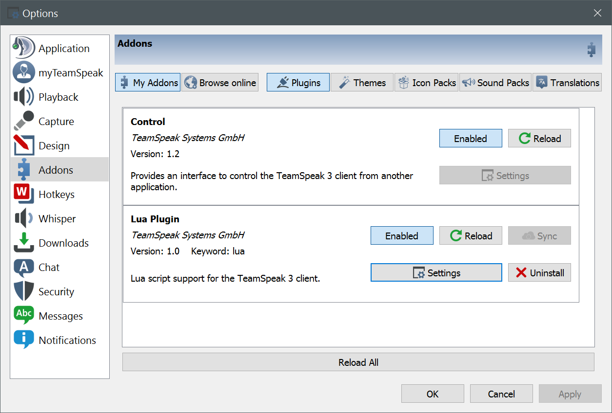
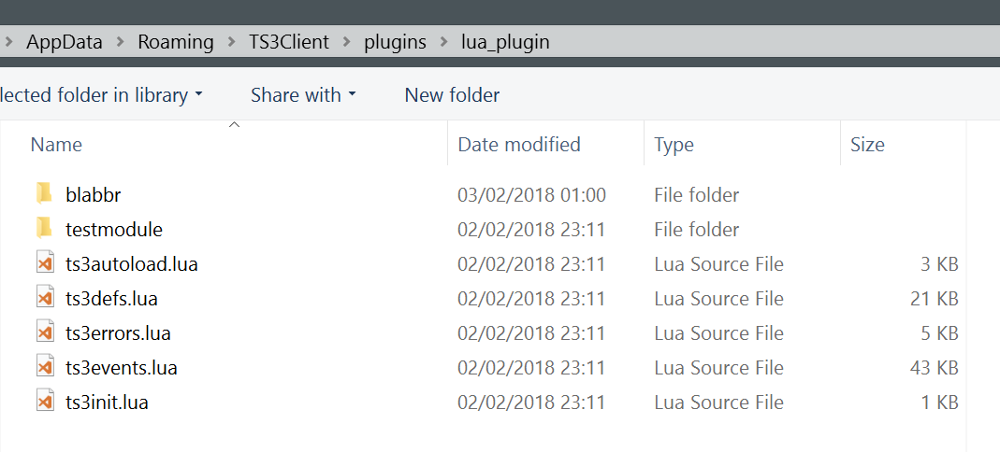
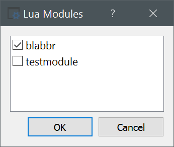

# Blabbr

A Lua plugin for Teamspeak 3 that will display the name of the speaker in the chatbox.

**Recent updates**
1. Display the speaker name in color. Edit `events.lua` to change the color.
2. Click on the speaker name to see a context menu.

## Example

## Getting Started

Download this repository. You only need the `blabbr` directory containing the Lua scripts.

These instructions have been tested on Windows 10. The plugin should work on Linux and Mac but the plugins directory will be in a different location (the plugin has been tested by other users).

## Prerequisites

You need to install the Lua plugin in Teamspeak before using this code.

This can be installed from the application Tools menu > Options > Addons > Browse online.

Type `lua` in the search field to find the lua plugin. Click on this and then click on the Install button. Once installed, make sure the Lua plugin is enabled and click Reload.

Verify that the following directory exists (replace `your-user-name` with your actual user name on Windows):

### Windows plugin directory

`C:\Users\your-user-name\AppData\Roaming\TS3Client\plugins\lua_plugin`

### Linux plugin directory

`~/.ts3client/plugins/lua_plugin`

### Mac plugin directory

`~/Library/Application Support/TeamSpeak 3/plugins/lua_plugin`

It should have some files in it from the installation of the Lua plugin. If you don't see any files there, go back to Lua Plugin > Settings and try ticking and unticking the testmodule.

## Installing

Copy the `blabbr` directory containing the Lua scripts to the lua_plugin directory.

On the Lua Plugin section of Teamspeak > Options > Addons, click Settings and tick the checkbox for `blabbr`, and click Reload.

## Author

* [tunasync](https://github.com/tunasync)

## License

This project is licensed under the GNU GPLv3 License - see the [LICENSE](LICENSE) file for details.
